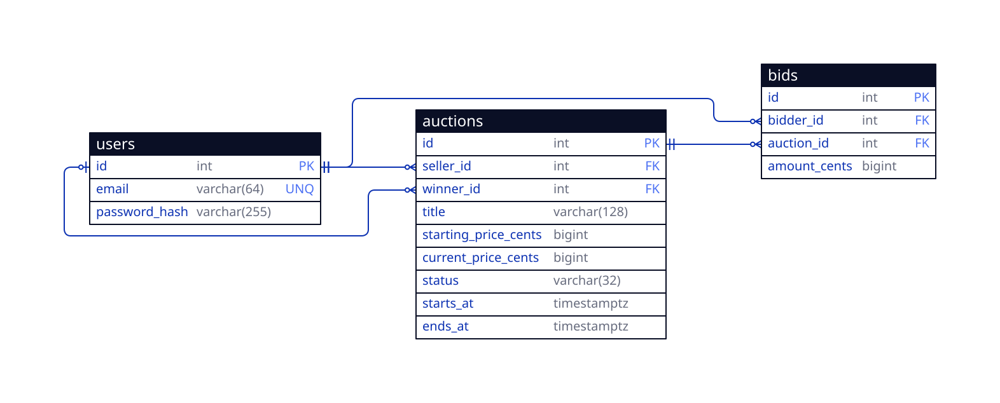

# User Flow Diagram

# Entity Relationship Diagram

# Tech Stack

- **Language:** TypeScript
- **Runtime:** Node.js
- **Package Manager:** NPM
- **Framework:** Express
- **ORM:** Prisma
- **Database:** PostgreSQL
- **Hosting:** AWS[^1]

[^1]: We'll start with Railway first, then migrate to AWS once the project is ready.

# Roadmap

- [x] **1. Design**
  - [x] Draw user flow diagram
  - [x] Draw entity relationship diagram
- [x] **2. Architecture Setup**
  - [x] Define repository interfaces (`UserRepository`, `AuctionRepository`, `BidRepository`)
  - [x] Implement the repositories with in-memory storage (for early testing)
- [x] **3. Authentication & Users**
  - [x] User registration, password hashing and login
  - [x] Auth middleware
- [ ] **4. Core Business Logic**
  - [ ] Auction creation and listing endpoints
  - [ ] Bidding logic and validation rules
  - [ ] Unit tests for business rules
- [ ] **5. Database Persistence (WIP - unverified AI draft from here onwards)**
  - [ ] Set up PostgreSQL
  - [ ] Apply database schema
  - [ ] Implement SQL/ORM repositories and swap out in-memory classes
- [ ] **6. Concurrency & Integrity**
  - [ ] Database transactions and row locking (`SELECT FOR UPDATE`) for bid placement
  - [ ] Test simultaneous outbid scenarios
- [ ] **7. Background Tasks & Lifecycle**
  - [ ] Scheduled worker to detect expired auctions and assign `winner_id`
- [ ] **8. Integration Testing, Packaging & Deployment**
  - [ ] Integration tests against the live database
  - [ ] Multi-stage Dockerfile for backend service deployment
  - [ ] Deploy initial MVP and managed PostgreSQL on Railway
  - [ ] *(Post-Launch)* Migrate infrastructure to AWS (ECS/App Runner + RDS)
