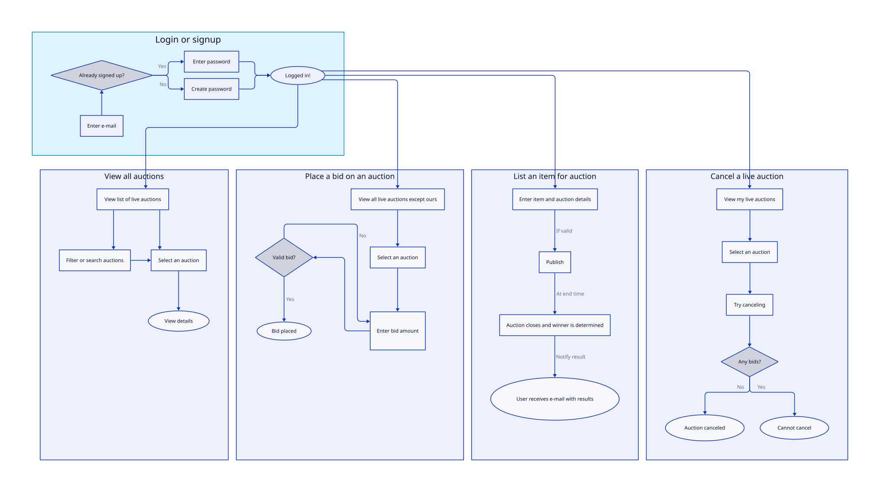

# User Flow Diagram

# Tech Stack

- **Language:** TypeScript
- **Runtime:** NPM
- **Framework:** Express
- **ORM:** Prisma
- **Database:** PostgreSQL
- **Hosting:** AWS[^1]

[^1]: We'll start with Railway first, then migrate to AWS once the project is ready.

# Roadmap

- [ ] Draw an User Flow Diagram so we get an idea of what the back-end needs to handle
- [ ] Draw an Entity Relationship Diagram (ERD) and then implement the data model
- [ ] Implement a minimal CRUD API
- [ ] Handle concurrency and related edge cases
- [ ] Implement scheduled tasks (e.g. auction closing)
- [ ] Implement authentication and authorization
- [ ] Implement integration tests and containerization
